# Guia de Instalação do Firmware Tasmota no Wemos D1 Mini Lolin com Módulo Relé Acoplado

Instalação do firmware **Tasmota** no **Wemos D1 Mini (ESP8266)** com o **módulo relé V2 acoplado**, permitindo controle remoto via Wi-Fi, MQTT e integração com Home Assistant.

--

## Repositorios com assuntos relacionados

* http://github.com/epaminondaslage/mini-lolin-relay-mqtt
* http://github.com/epaminondaslage/Wemos-Mini-Lolin

---

## 🧰 Materiais Necessários

- 1x Wemos D1 Mini (ESP8266)
- 1x Módulo Relé Shield V2.0.0 para Wemos
- 1x Cabo micro USB
- Navegador Google Chrome ou Microsoft Edge
- Acesso à internet

---

## 📸 Imagens dos Componentes

### Wemos D1 Mini (ESP8266)


### Shield Relé V2 para Wemos


---

##  Montagem do Hardware

1. Encaixe o **módulo relé shield V2** diretamente sobre o Wemos D1 Mini.
2. Conecte o conjunto ao computador via **cabo micro USB**.
   
---

# Instalação e Configuração do Tasmota

## Instalar o Firmware Tasmota via Navegador

1. Acesse: [https://tasmota.github.io/install](https://tasmota.github.io/install)
2. Conecte seu dispositivo ao computador. O navegador solicitará permissão para acessar a porta serial. 
3. Selecione a porta correta (ex: `COM6`) e clique em **Conectar**2. Clique em **"Connect"**

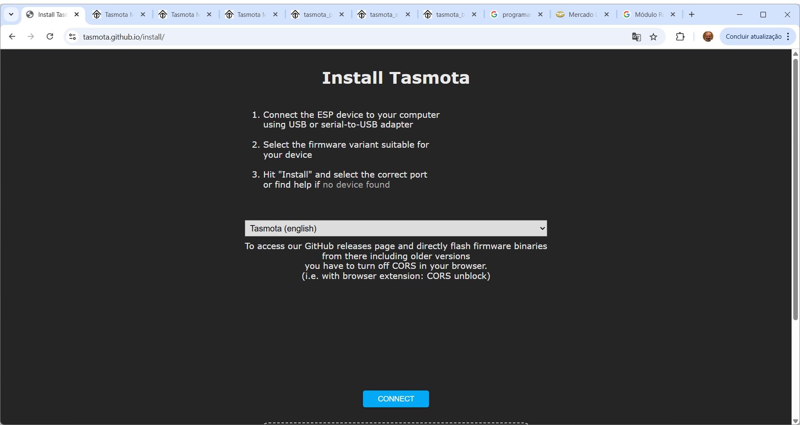

---

Clique em **Install Tasmota Lite** para iniciar o processo de gravação do firmware.

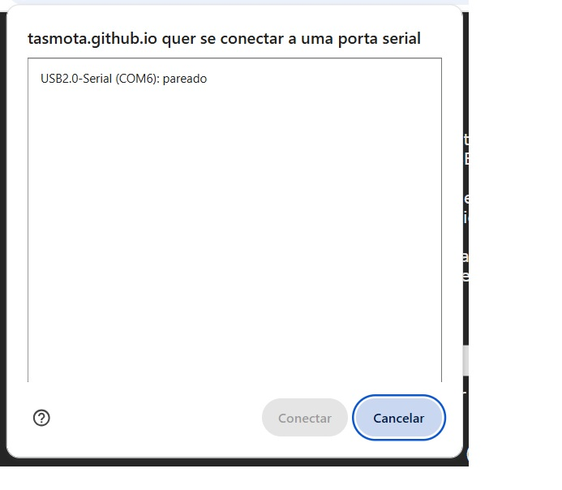

---

## Confirmação para apagar o dispositivo
Você poderá apagar a memória do dispositivo antes da gravação. Marque a caixa **Erase device** caso deseje apagar tudo.

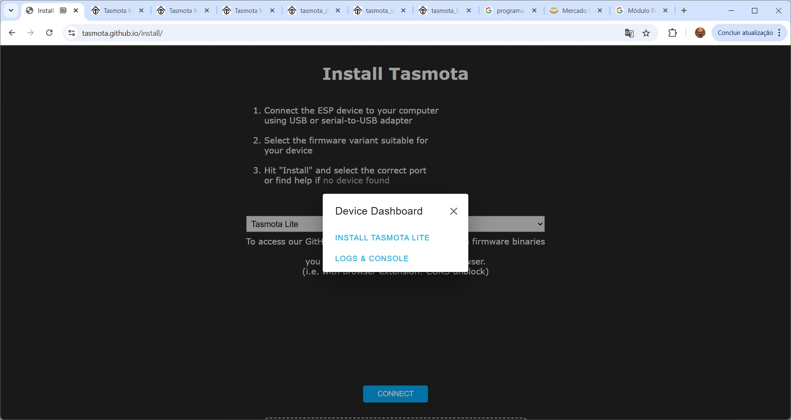

---

## Progresso da instalação
Aguarde enquanto o firmware Tasmota é gravado. Essa etapa pode levar alguns minutos.

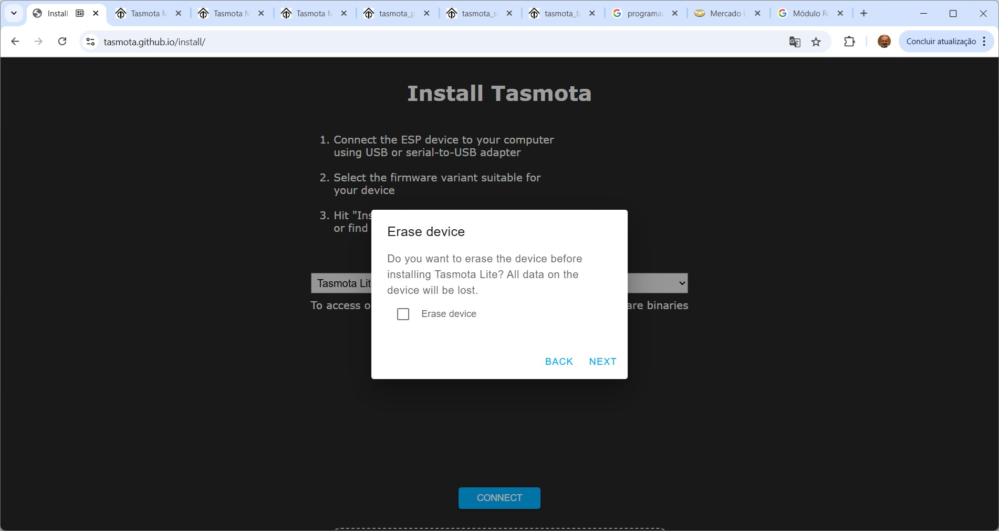

---

## Configuração de Wi-Fi
Após a gravação, o Tasmota solicitará os dados da sua rede Wi-Fi. Informe o SSID e a senha e clique em **Connect**.

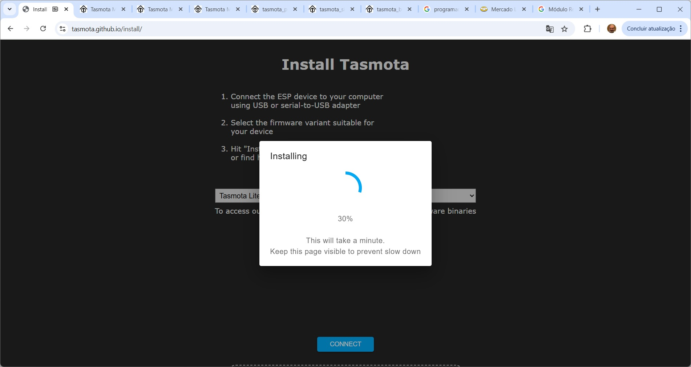


Caso pule esta etapa pode ser condifurado posteriormente para sua rede  Wi-Fi

1. Ligar o  ESP e ele entrará em modo AP com nome **`tasmota-XXXX`**
2. Conecte-se a esse Wi-Fi (senha: `tasmota123`)
3. Acesse automaticamente a página de configuração
4. Insira os dados da sua rede Wi-Fi local
5. O dispositivo reiniciará e se conectará à sua rede
---

## Tela inicial do Tasmota
Ao conectar à rede Wi-Fi, acesse o IP mostrado. Esta é a interface inicial do Tasmota.

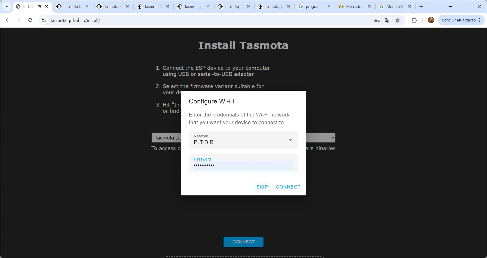


## Seleção de tipo de módulo
Na opção **Module**, escolha o tipo de dispositivo que está utilizando. Por padrão, o Sonoff Basic é selecionado, mas você pode alterar para **Generic** se estiver usando outro hardware. 

### Configurar o Módulo Relé

1. Acesse o IP do dispositivo na rede local
2. Vá em **Configuration > Configure Module**
3. Em “Module Type”, selecione: `Generic (18)`
4. Configure os GPIOs:

| GPIO        | Função no Tasmota | Conectado a...     |
|-------------|-------------------|---------------------|
| GPIO5 (D1)  | Relay1            | Entrada do Relé     |
| GPIO0 (D3)  | Switch1           | Botão físico (opcional) |

5. Salve e aguarde o reinício

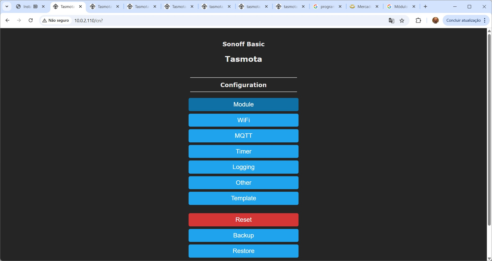

---

## Mapeamento dos pinos (GPIOs)
Configure os pinos GPIO conforme necessário. No exemplo, o **GPIO5** está configurado como **Relay**.

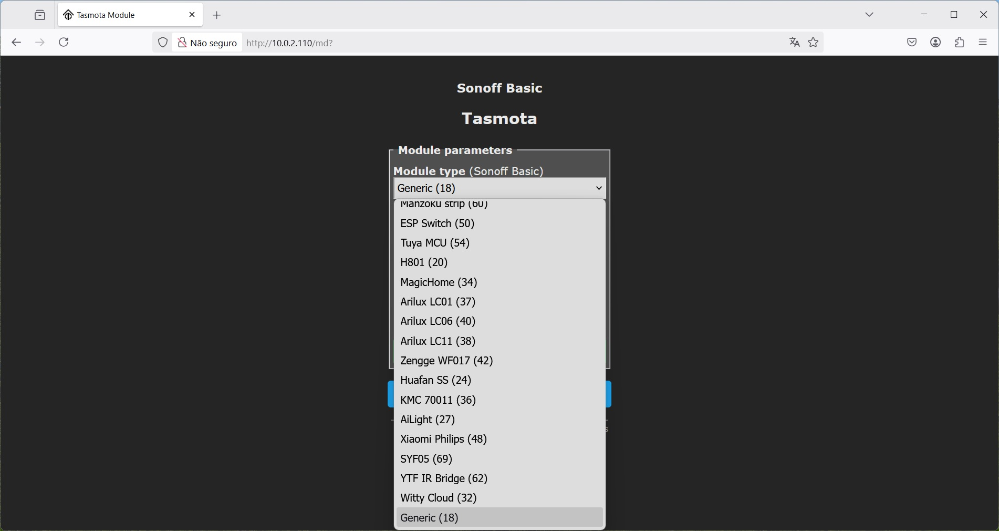

---
## Menu de configuração
Clique em **Configuration** para acessar as opções de configuração como WiFi, MQTT, módulo, etc.

### Configurar o Broker MQTT

1. Vá em **Configuration > Configure MQTT**
2. Preencha os campos conforme abaixo:

```
Host: 10.0.0.100 (ip do Broker)
Port: 1883
User: seuusuario
Password: suasenha
Topic: tasmota_%06X
Full Topic: %prefix%/%topic%/
```

3. Clique em **Save** e o dispositivo se conectará ao broker MQTT
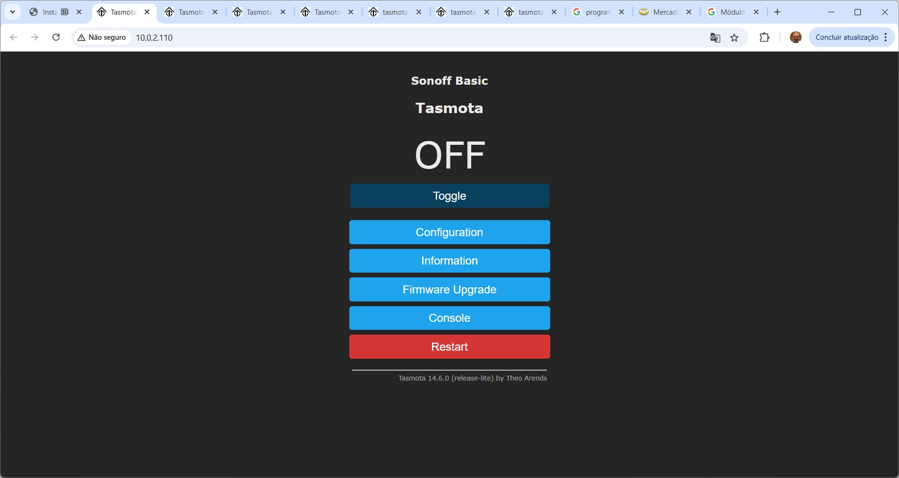

---

## Tela 10 - Tela principal após salvar configurações
Depois de salvar as configurações, o módulo será reiniciado e a interface refletirá as alterações, incluindo o nome do módulo (ex: "Generic").

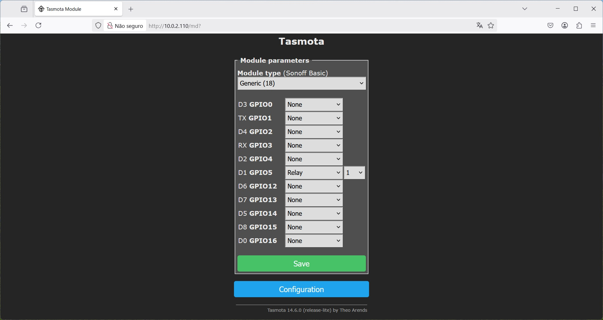

---

## Tela 11 - Retorno à interface principal
Você pode usar o botão **Toggle** para testar o funcionamento do relé ou dispositivo configurado.

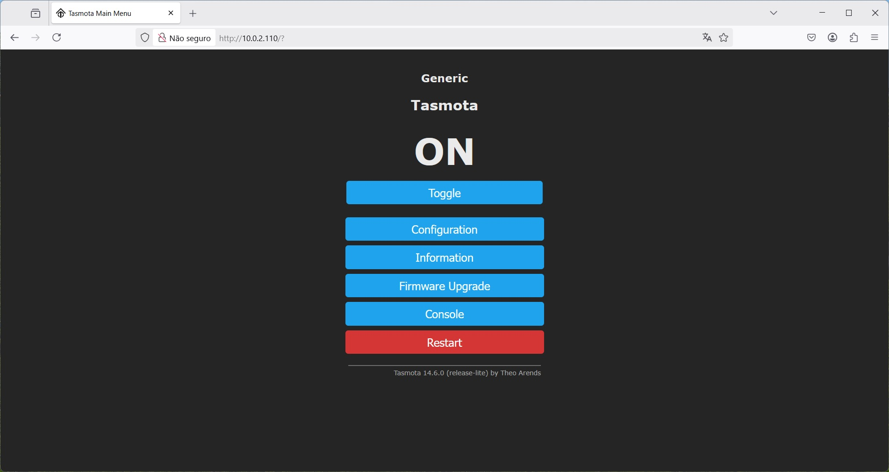

## Testar e Integrar

- Acesse novamente a interface web
- Pressione **TOGGLE** para acionar o relé
- Monitore a conexão MQTT no broker (ex: com MQTT Explorer)

---

