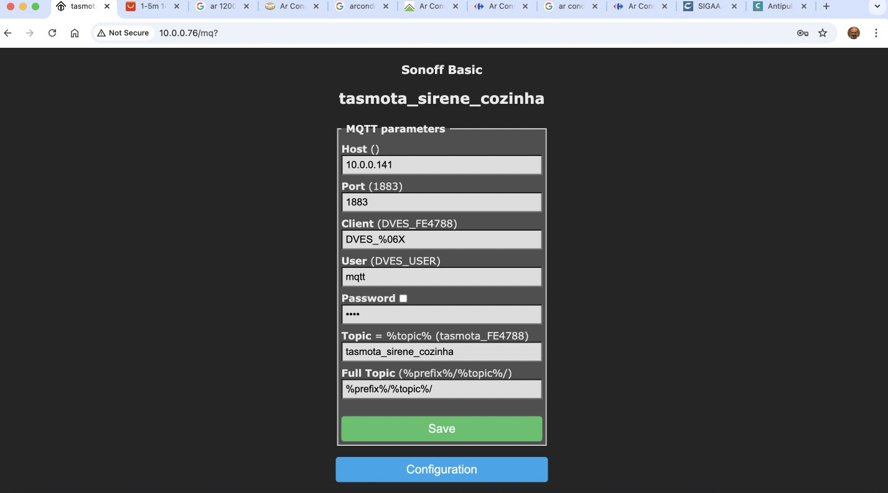

# Guia de Instalação do Firmware Tasmota no Wemos D1 Mini Lolin com Módulo Relé Acoplado

Instalação do firmware **Tasmota** no **Wemos D1 Mini (ESP8266)** com o **módulo relé V2 acoplado**, permitindo controle remoto via Wi-Fi, MQTT e integração com Home Assistant.

--

## Repositorios com assuntos relacionados

* http://github.com/epaminondaslage/mini-lolin-relay-mqtt
* http://github.com/epaminondaslage/Wemos-Mini-Lolin

---

## 🧰 Materiais Necessários

- 1x Wemos D1 Mini (ESP8266)
- 1x Módulo Relé Shield V2.0.0 para Wemos
- 1x Cabo micro USB
- Navegador Google Chrome ou Microsoft Edge
- Acesso à internet

---

## 📸 Imagens dos Componentes

### Wemos D1 Mini (ESP8266)


### Shield Relé V2 para Wemos


---

##  Montagem do Hardware

1. Encaixe o **módulo relé shield V2** diretamente sobre o Wemos D1 Mini.
2. Conecte o conjunto ao computador via **cabo micro USB**.
   
---

##  Tabela de GPIOs recomendados para Botão e Relé no Mini Lolin D1 (ESP8266)

| Função    | Nome na placa | GPIO   | Configuração no Tasmota | Observações                         |
|-----------|----------------|--------|---------------------------|--------------------------------------|
| Relé 1    | D1             | GPIO5  | Relay1 (21)               | Recomendado, seguro no boot          |
| Relé 2    | D5             | GPIO14 | Relay2 (22)               | Opcional                             |
| Relé 3    | D6             | GPIO12 | Relay3 (23)               | Opcional                             |
| Relé 4    | D7             | GPIO13 | Relay4 (24)               | Opcional                             |
| Botão 1   | D2             | GPIO4  | Button1 (17)              | Recomendado, sem problemas           |
| Botão 2 ⚠️ | D3             | GPIO0  | Button2 (18)              | ⚠️ Deve estar em HIGH no boot        |
| Botão 3 ⚠️ | D4             | GPIO2  | Button3 (19)              | ⚠️ Deve estar em HIGH no boot        |

---

### Dicas

- **Relés**: preferencialmente use GPIOs **5, 14, 12, 13** (D1, D5, D6, D7).
- **Botões**: **GPIO4 (D2)** é excelente para isso, sem conflitos de boot.
- **Evite** usar GPIO0, GPIO2 e GPIO15 com relés ou botões, a menos que saiba lidar com suas **restrições de boot**.

---

### Importante

- Sempre conecte **botões entre o GPIO e o GND**.
- O **resistor de pull-up interno** é ativado automaticamente pelo Tasmota para entrada digital.
- Relés ativos em nível **baixo (LOW)** devem ser testados para não ligarem sozinhos ao iniciar o dispositivo.


# Instalação e Configuração do Tasmota via Navegador (CRHOME)

## Acessar o site 

Acesse: [https://tasmota.github.io/install](https://tasmota.github.io/install)


Conecte seu dispositivo ao computador. O navegador solicitará permissão para acessar a porta serial. 

Selecione a porta correta (ex: `COM6`) e clique em **Conectar**2. Clique em **"Connect"**


---

Clique em **Install Tasmota Lite** para iniciar o processo de gravação do firmware.


---

## Confirmação para apagar o dispositivo
Você deverá apagar a memória do dispositivo antes da gravação. Marque a caixa **Erase device** caso deseje apagar tudo.


---

## Progresso da instalação
Aguarde enquanto o firmware Tasmota é gravado. Essa etapa pode levar alguns minutos.


---

## Configuração de Wi-Fi
Após a gravação, o Tasmota solicitará os dados da sua rede Wi-Fi. Informe o SSID e a senha e clique em **Connect**.


Caso pule esta etapa, o wifi pode ser confifurado posteriormente, conforme o procedimento:

1. Ligar o  ESP e ele entrará em modo AP com nome **`tasmota-XXXX`**
2. Conecte-se a esse Wi-Fi (senha: `tasmota123`)
3. Acesse automaticamente a página de configuração
4. Insira os dados da sua rede Wi-Fi local
5. O dispositivo reiniciará e se conectará à sua rede
---

## Tela inicial do Tasmota
Ao conectar à rede Wi-Fi, acesse o IP mostrado. Esta é a interface inicial do Tasmota.


## Seleção de tipo de módulo
Na opção **Module**, escolha o tipo de dispositivo que está utilizando. Por padrão, o Sonoff Basic é selecionado, mas você pode alterar para **Generic** se estiver usando outro hardware. 


1. Acesse o IP do dispositivo na rede local
2. Vá em **Configuration > Configure Module**
3. Em “Module Type”, selecione: `Generic (18)`


## Mapeamento dos pinos (GPIOs)
Configure os pinos GPIO conforme necessário. No exemplo, o **GPIO5** está configurado como **Relay**.

| GPIO        | Função no Tasmota | Conectado a...     |
|-------------|-------------------|---------------------|
| GPIO5 (D1)  | Relay1            | Entrada do Relé     |
| GPIO0 (D3)  | Switch1           | Botão físico (opcional) |


5. Salve e aguarde o reinício

---
## Menu de configuração
Clique em **Configuration** para acessar as opções de configuração como WiFi, MQTT, módulo, etc.

### Configurar o Broker MQTT (caso tenha um)

1. Vá em **Configuration > Configure MQTT**
2. Preencha os campos conforme abaixo:

```
Host: 192.168.0.10 (ip do Broker- caso tenha)
Port: 1883
User: seuusuario
Password: suasenha
Topic: tasmota_%06X
Full Topic: %prefix%/%topic%/
```
3. Clique em **Save** e o dispositivo se conectará ao broker MQTT
   

---

##  Interface principal

Você pode usar o botão **Toggle** para testar o funcionamento do relé ou dispositivo configurado.


## Testar e Integrar

- Acesse novamente a interface web
- Pressione **TOGGLE** para acionar o relé
- Monitore a conexão MQTT no broker (ex: com MQTT Explorer)

#  Configuração Tasmota: Manter Relé (GPIO5) Ligado por 3 Segundos

Como configurar o relé conectado à **GPIO5 (D1)** no Mini Lolin D1 (ESP8266) para **ligar por 3 segundos** sempre que acionado, usando **regras (Rules)** no Tasmota.

---

## 📍 Configuração do GPIO no Tasmota

| Função  | Nome na placa | GPIO   | Configuração no Tasmota |
|---------|----------------|--------|--------------------------|
| Relé 1  | D1             | GPIO5  | `Relay1 (21)`            |

---

## Regra para ligar o relé por 3 segundos

1. Acesse o Tasmota via navegador: `http://IP_DO_DISPOSITIVO`
2. Vá até o menu: **Console**
3. Insira os comandos abaixo:

```bash
Rule1 on Power1#State=1 do backlog Delay 30; Power1 0 endon
Rule1 1
```

---

### 🧠 Explicação

- `Power1#State=1`: Detecta quando o relé é ligado
- `Delay 30`: Aguarda 3 segundos (30 × 0,1s)
- `Power1 0`: Desliga o relé
- `Rule1 1`: Ativa a regra 1

---

##  Teste

- **Via botão físico**: Certifique-se de que um botão está conectado e configurado como `Button1 (17)` em outro GPIO.
- **Via MQTT**: Envie o comando:

```bash
cmnd/NOME_DO_TOPICO/Power1 ON
```

O relé ligará por 3 segundos e desligará automaticamente.

---

## ⚠️ Observações

- Certifique-se de que a **GPIO5** está configurada corretamente como `Relay1 (21)`
- A lógica da regra serve para **qualquer GPIO**, desde que você use o `PowerX` correspondente (Power1, Power2, etc.)

---


---

